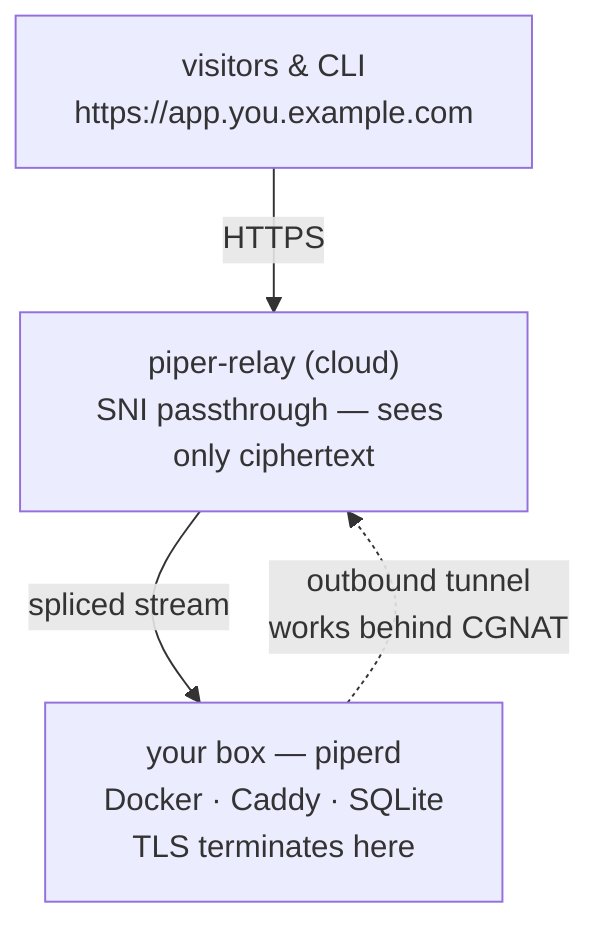

# Piper

[](https://github.com/getpiper/piper/releases/latest)
[](https://github.com/getpiper/piper/actions/workflows/ci.yml)
[](LICENSE)

**An open-source, developer-first PaaS: `git push → live HTTPS URL` on hardware
you own — including a Raspberry Pi at home behind CGNAT.**

Piper (Pi + *pipes traffic home*) runs on a single box you control and, via an
optional self-hostable **cloud relay**, tunnels public HTTPS traffic to it
without exposing your network — solving the NAT / CGNAT / dynamic-IP problem
that kills most homelab hosting.

## Why Piper

- **Zero-trust relay** — the relay only ever sees ciphertext (L4 SNI
  passthrough); TLS terminates on your box. Route through a relay you don't
  own, safely.
- **Lean** — built to run on a Raspberry Pi. SQLite state, embedded Caddy for
  TLS.
- **Developer-first** — a scriptable CLI *and* a full-screen TUI (bare
  `piper`), Dockerfile-based builds. On the box itself the CLI needs no login.

## 60-second quick start

On a Linux box (a Pi counts):

```bash
curl -fsSL https://raw.githubusercontent.com/getpiper/piper/main/install.sh | sh
piper login                  # GitHub device-flow; stores your account credential
piper connect                # enrolls this box on the public relay
                             # (systemd installs: run the sudo command it prints)
sudo systemctl restart piperd
piper deploy blog --path .   # → https://<hash>-<you>.public.getpiper.dev
```

That's a Dockerfile built, health-checked, and served on a public HTTPS URL —
no port forwarding, no domain required. Prefer to point and click? Run bare
`piper` in a terminal for the full-screen TUI — monitor, deploy, logs,
lifecycle, box switcher, and the login/GitHub wizards, all interactive. LAN-only
use, driving a box from your laptop, and self-hosted relays are all covered in
the full walkthrough: [`docs/getting-started.md`](docs/getting-started.md).

## How it works



One Go module, three binaries:

| Binary | Runs | Does |
| --- | --- | --- |
| `piperd` | on your box | control plane, Docker build/run, health checks, Caddy routing, tunnel client |
| `piper-relay` | in the cloud (optional) | SNI passthrough + tunnel server — always self-hostable; the hosted instance runs this same code |
| `piper` | anywhere | the CLI — drives `piperd` locally, over the LAN, or through the relay |

Apps on your own domain stay **end-to-end encrypted**: the box holds the cert
and the relay just splices bytes by SNI. On the shared
`public.getpiper.dev` domain the relay terminates TLS with its wildcard cert
instead. See [`docs/custom-domains.md`](docs/custom-domains.md).

## Git deploys

Once your box is relay-connected, a `git push` builds and publishes. Piper uses
a **per-user GitHub App** you create yourself — the private key and webhook
secret never leave your box.

```bash
piper create myapp --port 8080                       # register the app
piper github setup                                   # create your GitHub App (one-time)
# install the App on your repo in GitHub, then:
piper app link myapp --repo owner/name --branch main
```

Every push to the tracked branch builds the Dockerfile at the repo root,
health-checks the container, and serves it at `https://myapp.<your-domain>` —
the live URL appears on GitHub as a Deployment status. Webhooks ride the same
tunnel as your traffic; nothing else on the box is exposed.

## Docs

| Doc | Covers |
| --- | --- |
| [Getting started](docs/getting-started.md) | install → TUI → LAN control → public relay → remote control → git deploys |
| [Manual setup](docs/manual-setup.md) | build from source, piperd in Docker, run the relay as a service |
| [Custom domains](docs/custom-domains.md) | BYO domain with end-to-end TLS |
| [E2E runbook](docs/runbooks/git-deploy-e2e.md) | stand up relay + domain + GitHub App from scratch |
| [PROGRESS.md](PROGRESS.md) | built vs. stubbed map, linked to issues |
| [Design](docs/superpowers/specs/2026-07-04-piper-design.md) | the full design rationale |

## Contributing

[Issues](https://github.com/getpiper/piper/issues) carry an `[area]` title
prefix (`[agent]`, `[cli]`, `[relay]`, …); new here? Look for
[`good first issue`](https://github.com/getpiper/piper/labels/good%20first%20issue).
How to work in this repo — coding principles, branch workflow, issue
conventions — lives in [`CLAUDE.md`](CLAUDE.md). Trunk-based: branch off
`main`, open a PR back into it, squash-merge; CI's `verify` gate (gofmt ·
`go vet` · tests · arm64 cross-compile) must pass.
